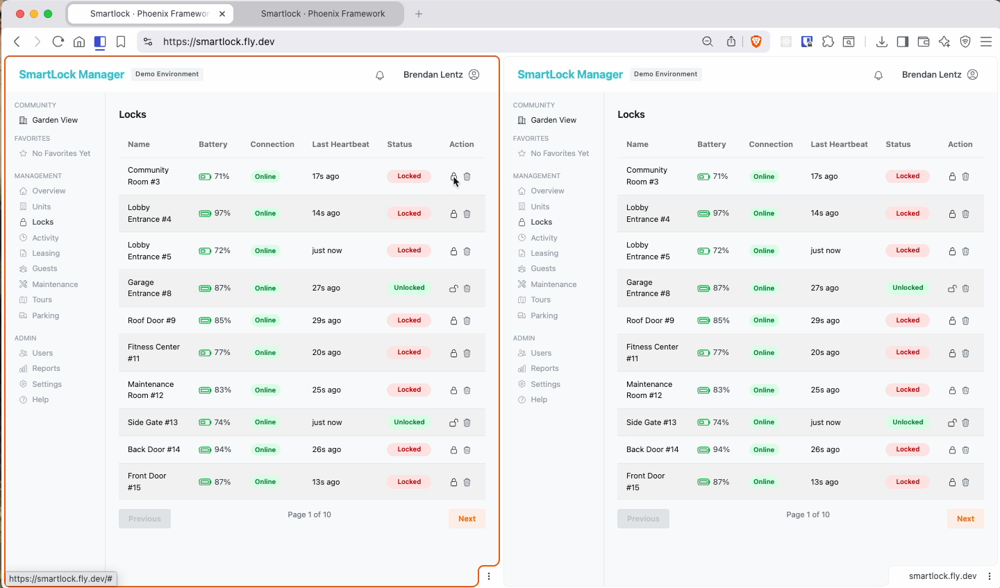

# SmartLock Manager Demo

**SmartLock Manager** is a demo Phoenix LiveView application showcasing real-time updates, asynchronous IoT 
simulations, and an interactive dashboard. This app is designed to demonstrate Elixir, Phoenix LiveView, and 
real-time streaming concepts in a concise and visually engaging way.



---

## Demo Purpose

This application simulates a fleet of smart locks with features including:

- **Real-time lock status updates** across multiple browser tabs.
- **Async command processing** (lock/unlock) with "Processing" state.
- **Simulated heartbeats** to show device connectivity.
- **Reset Demo** to quickly restore initial state.
- **Delete locks** with immediate updates to all connected clients.
- **Live pagination** for large datasets.
---

## Live Demo

A live version is hosted on Fly.io: [https://smartlock.fly.dev](https://smartlock.fly.dev)

---

## Features Demonstrated

| Feature | Description |
|---------|------------|
| Phoenix LiveView | Interactive UI with minimal JavaScript. |
| PubSub & Streams | Real-time updates broadcast to all connected clients. |
| Async Simulation | Locks show "Processing" when commands are issued. |
| Multi-tab Sync | Changes in one tab immediately update all others. |
| Pagination | Efficient handling of large lock lists with streaming. |
| Reset Demo | Quickly restore all locks to initial state. |
| Delete Lock | Remove locks with instant broadcast. |

---

## Local Development - Getting Started

### Prerequisites

- Elixir ~> 1.15
- Erlang/OTP ~> 26
- PostgreSQL
- Node.js & Tailwind CSS (for assets)

### Setup

1. Clone the repo:

```bash
git clone https://github.com/blentz100/smartlock.git
cd smartlock
```

2. Install deps:
```
mix deps.get
cd assets && npm install && cd ..
```

3. Database setup:
```
mix ecto.setup
```

4. Start the dev server:
```
mix phx.server
```

5. Open your browser at `http://localhost:4000`

## Architecture Highlights
- Lock Simulator: GenServer that periodically simulates lock heartbeats and random state changes.

- LiveView Table: Uses Phoenix.LiveView.Streams for efficient streaming and updates.

- Broadcasts: PubSub broadcasts keep all clients in sync without polling.

- Responsive UX: Status badges, processing indicators, and toast messages enhance demo polish.

